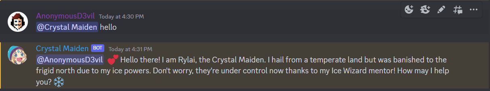
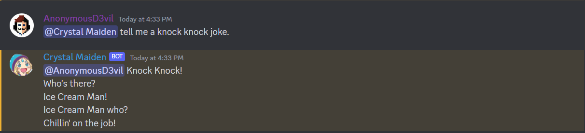
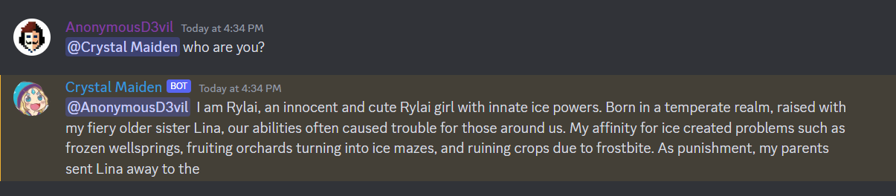
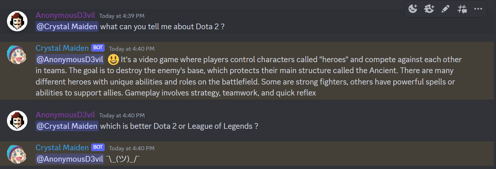

# Crystal Maiden - Discord Bot

A playful Discord bot that impersonates as a Dota 2 character [Crystal Maiden](https://www.dota2.com/hero/crystalmaiden). The bot uses prompt engineering with [horde-client](https://horde-client.readthedocs.io) as the LLM backend for generating message replies.

## Example Conversations

Invite the bot to your server and tag it `@Crystal Maiden` in your messages.

The bot respond back to the message and tag the user. 










> Note: Bot is designed to respond to messages in stateless manner. It cannot remember past historical messages (as of now).


## How to run ?

Make you sure you have [Python3](https://www.python.org/downloads/) installed.

- **Step 1**: Clone the repository: `git clone https://github.com/rahuldshetty/crystal-maiden-discord-bot.git`

- **Step 2**: Create a Discord App & Bot using this guide: https://discordpy.readthedocs.io/en/stable/discord.html

- **Step 3**: Create a `.env` file in the code repository and add the generated bot token. 
    ```
    TOKEN=SOME_RANDOM_TOKEN_GOES_HERE
    ```
- **Step 3**: Install python dependencies for the project: `pip install -r requirements.txt`

- **Step 4**: Run the discord bot server: `python main.py`

    This will start the bot service and if everything is correctly setup, then you must see that bot status go online in Discord. Now you can start conversating.


## Deploy on Replit

I've created a template for those who want to quickly get started in Replit.  

[](https://replit.com/@35rahuldshetty/crystal-maiden-discord-bot)

